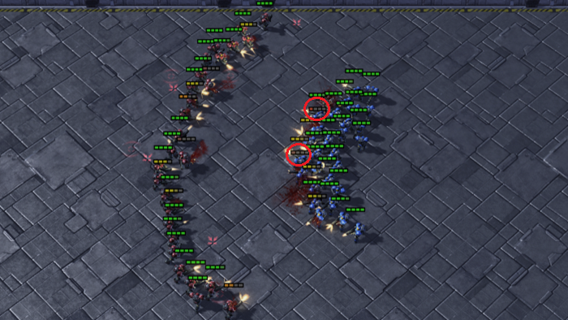
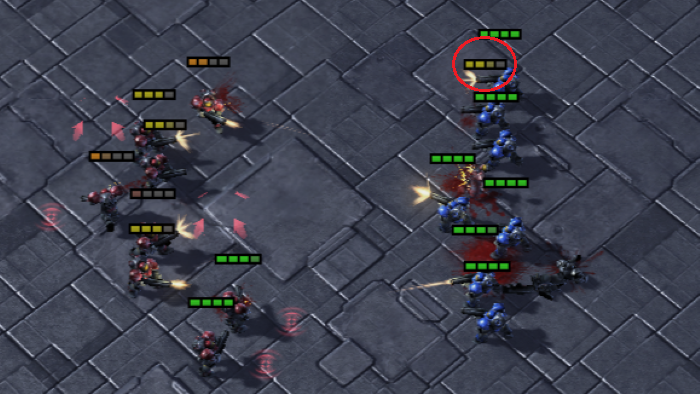
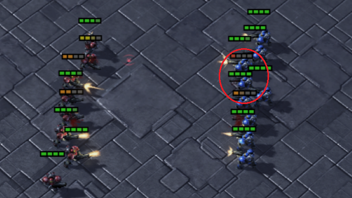
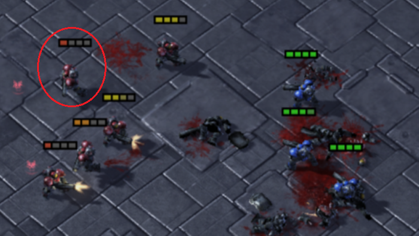
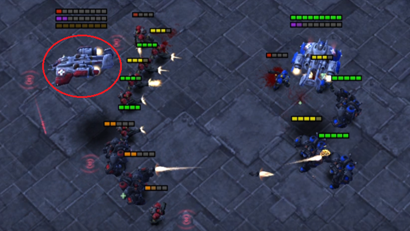
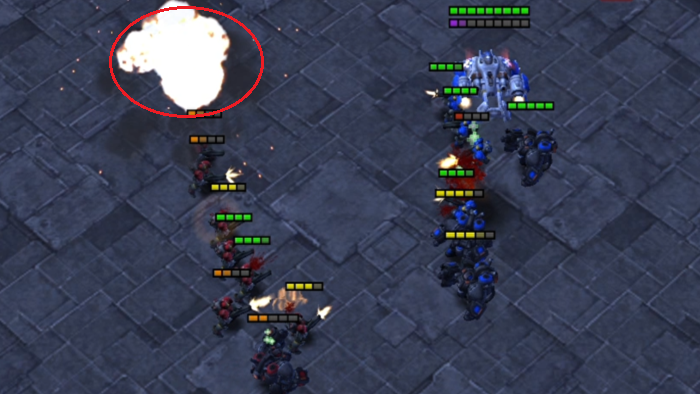

# 
The ***master*** branch is utilized for single-task training, the ***football*** branch for multi-task pre-training in the GRF environment, and the ***multienv*** branch for multi-task pre-training in the SMAC environment. Our algorithms are implemented based on the [Pymarl2](https://github.com/hijkzzz/pymarl2) algorithm library.

## Environment Installation

Install Python packages

```shell
# require Anaconda 3 or Miniconda 3
conda create -n pymarl python=3.8 -y
conda activate pymarl

bash install_dependecies.sh
```

Set up StarCraft II (2.4.10) and [SMAC](https://github.com/oxwhirl/smac):

```shell
bash install_sc2.sh
```

This will download SC2.4.10 into the 3rdparty folder and copy the maps necessary to run over.

Set up [Google Football](https://github.com/google-research/football):

```shell
bash install_gfootball.sh
```

## Run

Multi-task pre-training for SMAC (using *multienv* branch).

```shell
# CUDA_VISIBLE_DEVICES: select available gpu devices
# map-list: select the maps to train
CUDA_VISIBLE_DEVICES=0,1,2,3,4,5,6,7 python3 src/main.py --config=avdn --env-config=sc2 --map-list=5m_vs_6m,8m_vs_9m,2c_vs_64zg,3s5z_vs_3s6z,MMM2,corridor
```

Multi-task pre-training for GRF (using *football* branch).

```shell
# CUDA_VISIBLE_DEVICES: select available gpu devices
# map-list: select the maps to train
CUDA_VISIBLE_DEVICES=0,1,2,3 python3 src/main.py --config=avdn_gfootball --env-config=gfootball --map-list='academy_3_vs_1_with_keeper,academy_counterattack_easy,academy_run_to_score_with_keeper,academy_run_pass_and_shoot_with_keeper' --numagents-list='3,4,2,2'
```

Transfer pre-trained policy to singe task (using *master* branch). Remember to set *checkpoint_path* in [default.yaml](src/config/default.yaml) to the pre-trained policy path and set *use_pretain_policy* to True.

```shell
# CUDA_VISIBLE_DEVICES: select available gpu devices
CUDA_VISIBLE_DEVICES=0 python3 src/main.py --config=avdn --env-config=sc2 with env_args.map_name=27m_vs_30m
```

## Video

Set *save_replay* in [default.yaml](src/config/default.yaml) to True, download the Battle.net client and install StarCraft 2 for visualization.

||||
|:-------:|:------------------:|:-----------------:|
|pre-trained $task_{9}$ in $Group_{2}$ [[Video_a](https://youtu.be/Ng1axoM43j8)]|$task_{2}$ w pre-trained DecL at 6M steps [[Video_b](https://youtu.be/HCamoGRcRs0)]|$task_{2}$ w/o pre-trained DecL at 6M steps [[Video_c](https://youtu.be/HF8Bj9lVdlI)]|
||||
|pre-trained $task_{1}$ in $Group_{1}$ [[Video_d](https://youtu.be/M-0BlV-cSxE)]|$task_{7}$ w pre-trained DecL at 10M steps [[Video_e](https://youtu.be/E2PG1Mejf3c)]|$task_{7}$ w/o pre-trained DecL at 10M steps [[Video_f](https://youtu.be/MGV8PA71x8s)]|

Video a shows the training performance of 27m_vs_30m in multi-task pre-training. Video b demonstrates the performance of 8m_vs_9m when trained up to 6M steps using pre-trained DecL. Video c presents the performance of 8m_vs_9m when trained from scratch up to 6M steps. In video a, all Marines position themselves effectively during the attack, focusing their firepower on a single enemy, which rapidly reduces the number of enemies. In video b, the Marines similarly adopt a concentrated fire strategy, successfully gaining a numerical advantage. However, in video c, the Marines attack two enemy Marines simultaneously. Due to their numerical disadvantage and dispersed firepower, they are ultimately defeated.

Video d shows the training performance of 5m_vs_6m in multi-task pre-training. Video e demonstrates the performance of MMM2 when trained up to 10M steps using pre-trained DecL. Video f presents the performance of MMM2 when trained from scratch up to 10M steps. In video d, a Marine retreats promptly when its health is low, successfully diverting enemy fire to other teammates with higher health. In video e, the Medivac also employs a retreat strategy, ensuring the continuous recovery of the health of other agents. However, in video f, the Medivac fails to adopt an effective evasion strategy, leading to its loss and preventing the timely recovery of the health of other agents, ultimately resulting in defeat.

## Citation
If you find this work useful, please consider citing:
```
@article{wang2023multi,
  title={Multi-Task Multi-Agent Shared Layers are Universal Cognition of Multi-Agent Coordination},
  author={Wang, Jiawei and Zhao, Jian and Cao, Zhengtao and Feng, Ruili and Qin, Rongjun and Yu, Yang},
  journal={arXiv preprint arXiv:2312.15674},
  year={2023}
}
```
